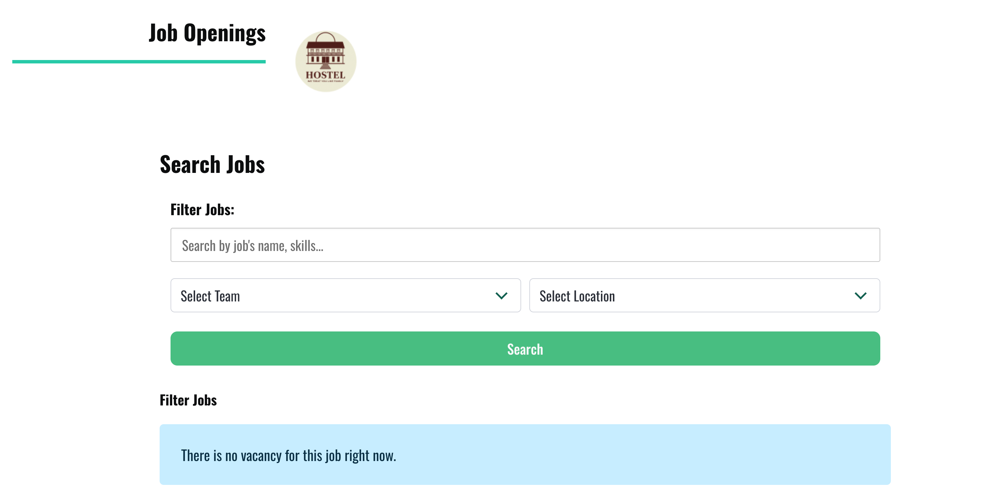
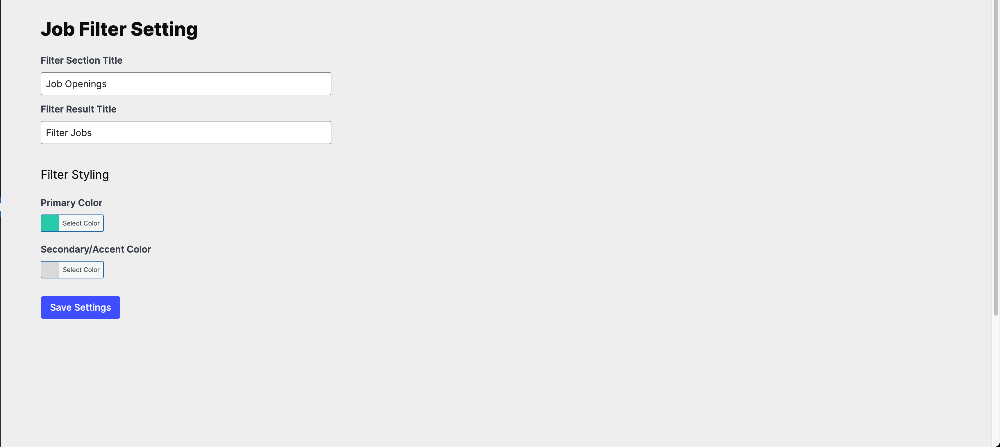
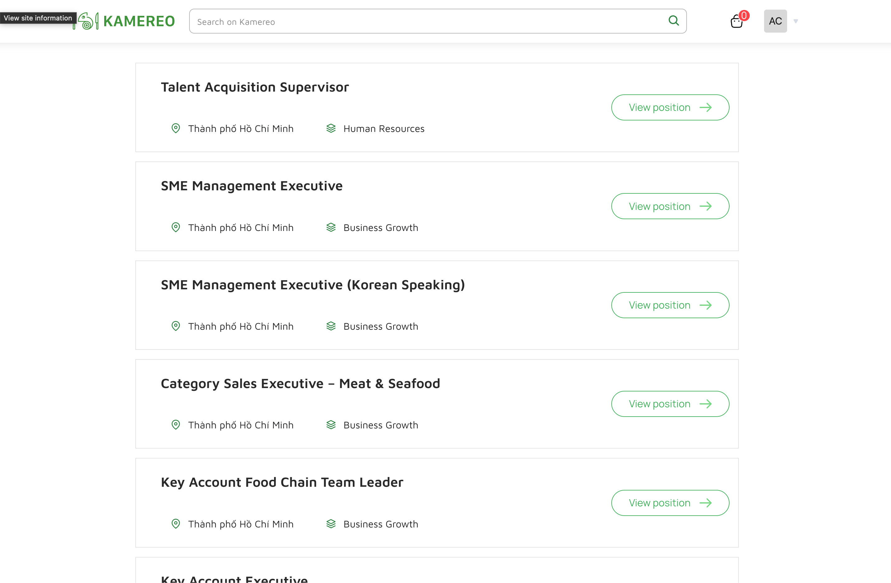

# Job Filter for Job Postings

A WordPress plugin to filter job postings based on various criteria.  
Easily integrates with the [Job Postings](https://wordpress.org/plugins/job-postings/) plugin to provide advanced filtering options for your job listings.

---

## Features

- Filter jobs by category, location, and keywords
- AJAX-powered search for instant results
- Customizable filter section and result titles
- Color customization for filter UI
- Widget and shortcode support
- Bulma CSS framework integration

---

## Screenshots

Below are screenshots from the `screenshot` directory:





---

## Requirements

- WordPress 5.0+
- [Job Postings](https://wordpress.org/plugins/job-postings/) plugin (required)

---

## Installation

1. **Upload the plugin:**

   - Upload the `job-filter-for-job-postings` folder to your `/wp-content/plugins/` directory.

2. **Activate the plugin:**

   - Go to the WordPress admin dashboard.
   - Navigate to **Plugins > Installed Plugins**.
   - Activate **Job Filter for Job Postings**.

3. **Ensure Job Postings plugin is active:**
   - This plugin requires the [Job Postings](https://wordpress.org/plugins/job-postings/) plugin.

---

## Usage

- The filter will automatically appear on the jobs archive page.
- Use the `[job_filter]` shortcode to display the filter on any page or post.
- Customize filter settings in **Settings > Job Filter**.

---

## Customization

- Change filter section title, result title, and colors in the plugin settings page.
- Use the widget in **Appearance > Widgets** to add the filter to your sidebar or footer.

---

## Development

- CSS is built with Bulma and PostCSS.
- To build assets:
  ```bash
  npm install
  npm run css-build-dev
  //or
  npm run css-build-min
  ```
- To prefix CSS classes, use the provided PostCSS and Node.js scripts. Modify the TARGET_DIR value equal to the target dir
  ```bash
    node prefix-classes.js
  ```

---

## License

GPL v2 or later  
See [LICENSE](https://www.gnu.org/licenses/gpl-2.0.html) for details.

---

**Author:** [Antonio](https://antonio-doan.tech/)
